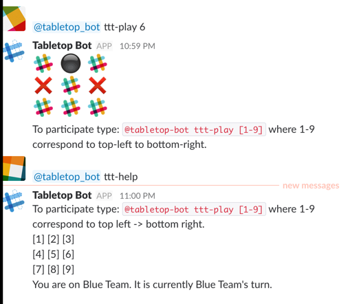
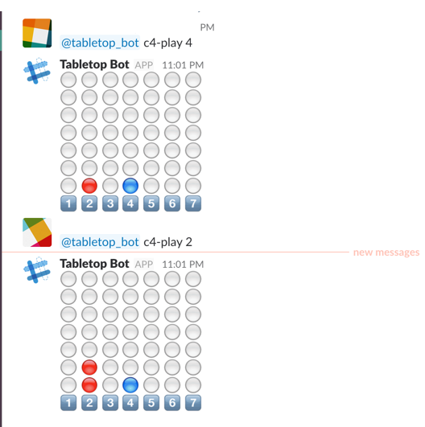
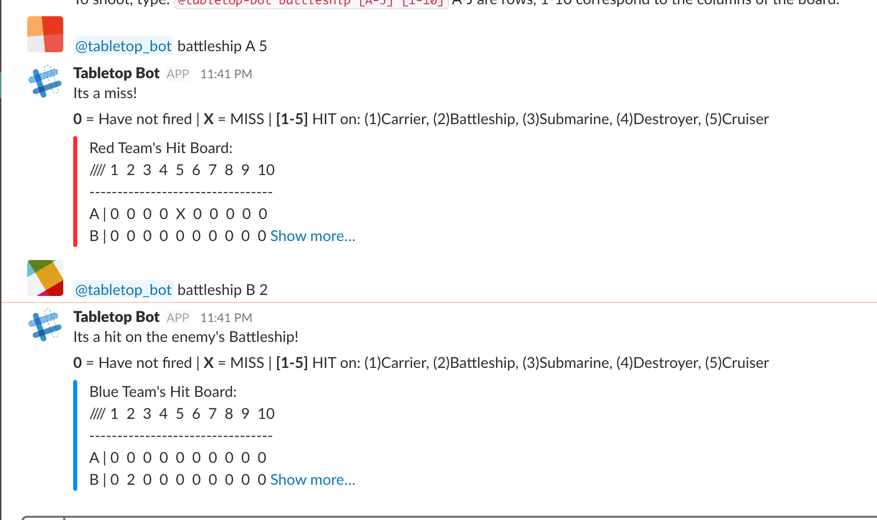

# Slack Plays Tabletop games
A simple slackbot that allows you to add team game functionality to your workspace!
Currently supports tic-tac-toe, Connect 4 and Battleship!

# Installation
- clone the directory
- $virtualenv tbbot
- $source tbbot/bin/activate
- $pip install -r requirements.txt
- export SLACK_BOT_TOKEN="your-bot-user-access-token-goes-here"
- python tabletopbot.py

# Usage
Add this bot as an app to any channel, and run the bot. The following commands can be used to interface with the bot:
- \@tabletop_bot help : helper commands if you're stuck, will also show which team you're on.
- \@tabletop_bot ttt-[help/start/play] [1-9] : initiate a tic tac toe session in the channel
- \@tabletop_bot c4-[help/start/play] [1-7] : initiate a connect 4 session in the channel
- \@tabletop_bot battleship-start : places battleships randomly for both sides, and begins a new game of battleship
1. \@tabletop_bot battleship [A-J] [1-10] : shoot at that point for your team!
- \@tabletop_bot leaderboard : show the current leaderboard

# Check it out in action!

